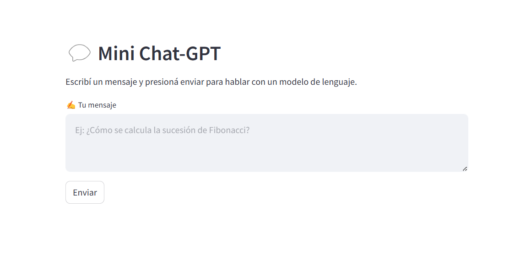

# 💬 Mini Chat-GPT con Streamlit

Este es un proyecto educativo que demuestra cómo crear una interfaz web simple para interactuar con un modelo de lenguaje (GPT-3.5-turbo) usando la API oficial de OpenAI y Streamlit.

Ideal para estudiantes que están empezando con IA generativa y quieren ver un ejemplo práctico funcionando.

---

## ✅ ¿Qué hace esta app?

- Permite escribir un mensaje (prompt) desde una interfaz web
- Envía ese mensaje a la API de OpenAI
- Muestra la respuesta generada por el modelo en pantalla
- Todo desde una interfaz clara, sin necesidad de saber backend

---

## 📦 Requisitos

- Python 3.11 o superior
- Una clave de API de OpenAI (gratis o paga)

---

## 🚀 Instalación paso a paso

### 1. Descargar el proyecto

Cloná el repositorio o descargalo como ZIP y descomprimilo:

```bash
git clone https://github.com/TU_USUARIO/mini-chat-gpt.git
cd mini-chat-gpt
```

### 2. Crear entorno virtual (opcional pero recomendado)

```bash
python -m venv venv
```

Activar en Windows:

```bash
.env\Scripts\activate
```

En Mac/Linux:

```bash
source venv/bin/activate
```

### 3. Instalar dependencias

```bash
pip install -r requirements.txt
```

---

## 🔐 Configurar la API Key

1. Copiá el archivo de ejemplo:

```bash
copy .env.example .env
```

2. Abrí el archivo `.env` y pegá tu clave de OpenAI:

```env
OPENAI_API_KEY=sk-xxxxxxxxxxxxxxxxxxxxxxxxxxxxxxxx
```

Podés obtener tu clave desde: https://platform.openai.com/account/api-keys

---

## ▶️ Ejecutar la app

Con el entorno virtual activado y la clave cargada, corré:

```bash
streamlit run mini_chat.py
```

La app se abrirá automáticamente en tu navegador en:  
👉 `http://localhost:8501`

---

## 🛑 ¿Cómo detener la aplicación?

Desde la terminal presioná:

```bash
Ctrl + C
```

---

## 📸 Captura de ejemplo



---

## 🧠 ¿Qué tecnologías se usan?

- `streamlit`: para la interfaz web
- `openai`: cliente oficial para usar modelos GPT
- `python-dotenv`: para cargar la API key desde un archivo `.env`

---

## ✨ Créditos

Desarrollado por [Juan Manuel Fernández](https://github.com/jumafernandez) para fines educativos.  
Basado en la API oficial de [OpenAI](https://platform.openai.com/).

---
